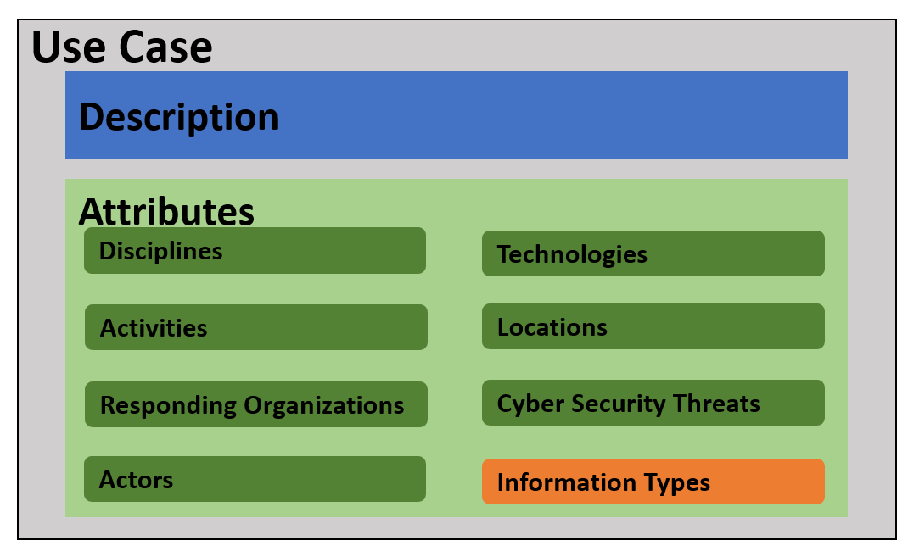

Formalizing Public Safety Scenarios With Use Cases
=========================================================================================================

Defining the Term Use Case
--------------------------

**Use cases** are used in many domains for many purposes. Loosely, they
are used to describe relevant *features* of a *scenario* and how those
*features* influence *considerations* for the *audience*. For a use case
to be valuable, it must achieve two basic criteria. First, it must
describe the scenario so that it is precise, accurate, and contains
enough context given your audience. Second, it must highlight the
features of the scenario that achieve your goal to your audience. Of
course, how to fulfill these criteria is very dependent on the audience
and the goal.

Consider for example the following use case, borrowed from [*NISTIR 8181
Incident Scenarios Collection for Public Safety Communications Incident
Scenarios Collection for Public Safety
Communications*](https://nvlpubs.nist.gov/nistpubs/ir/2017/NIST.IR.8181.pdf):



This use case was borrowed from a document whose goal was to
contextualize public safety tasks in terms of usability and emerging
technology. We can see in this example some excellent features being
identified: location, actors, temperature data, etc. However, there are
a lot of gaps to fill when thinking of this in terms of which
cybersecurity concerns this scenario may contain.

There is no one-size-fits all solution for describing all public safety
use cases. The goal of this project was to improve the security of
mobile apps for public safety by addressing our three core audiences
described in the above section. To achieve this goal, we set out to
design a loosely structured use case model. The remainder of this
section describes how we structured this model in service achieving our
success factors.

The anatomy of a Use Case for Cybersecurity
-------------------------------------------

A use case consists of two components: a *description* and a collection
of *attributes*. Figure 1 depicts how they each fit together.

Figure The parts of a use case

### Use Case Description

The *description* is a prose description of the scenario for the use
case. During our research, when we set out to find existing public
safety use cases, this is often what we found. They could range from a
single paragraph to multiple pages of description. While often
unstructured, the *description* serves as the most important way to
"tell the story" of the scenario in question. It serves as a narrative
for the scenario itself. In our research, this was often lifted whole
cloth from whatever source we were using.

### Attributes

*Attributes* are named *features* of the scenario used to properly
characterize the scenario in a use case. Attributes are identified by
their *attribute type.* Attribute types are simply convenient labels
that help to group similar attributes together. We identified eight
attribute types that are important for accurately describing public
safety use cases. The first six are simply name/description pairs and
help group descriptive *features* of the scenario:

-   **Discipline** -- a simple label that describes from which
    perspective (fire, EMS, and law enforcement) the use case is being
    told.

-   **Activity** -- the operations being conducted by public safety
    during the use case

-   **Responding Organization** -- what public safety entities are
    present or being considered as part of the use case

-   **Actor** -- any individuals/roles that are part of the use case.
    Actors are any person, not just public safety official (patients,
    suspects, civilians, etc.).

-   **Technology** -- any technologies that are a coordinated part of
    the scenario.

-   **Location** -- a loose bucket intended to informally characterize
    where the scenario is taking place.

A seventh attribute type, **cybersecurity threat** was included in the
model to identify any specific cyber threats that are part of the
scenario. It was intended to be a place to identify scenarios that
specifically contained targeted cyber-attacks.

The final attribute type, **Information Type**, serves as the container
for the main cybersecurity guidance of the use case project. Information
types have two purposes:

1.  They are used to capture the classes of data that are central to the
    scenario depicted by the use case.

2.  They contextualize that data's risk in terms of
    [*confidentiality*](https://csrc.nist.gov/glossary/term/confidentiality),
    [*availability*](https://csrc.nist.gov/glossary/term/availability),
    and [*integrity*](https://csrc.nist.gov/glossary/term/integrity).

We characterize confidentiality, availability, and integrity in terms of
their level of impact as described in [FIPS
199](https://nvlpubs.nist.gov/nistpubs/FIPS/NIST.FIPS.199.pdf):

> **Low -** The loss of confidentiality, integrity, or availability
> could be expected to have a **limited** adverse effect on
> organizational operations, organizational assets, or individuals.
>
> **Moderate -** The loss of confidentiality, integrity, or availability
> could be expected to have a **serious** adverse effect on
> organizational operations, organizational assets, or individuals.
>
> **High -** The loss of confidentiality, integrity, or availability
> could be expected to have a **severe or catastrophic** adverse effect
> on organizational operations, organizational assets, or individuals.
>
> 

Finally, a use case should contain at least one information type and one
discipline. Otherwise it can have any number of the remaining
attributes.

Check out the [Sample Data](usecases.html) section for some example use
cases.
