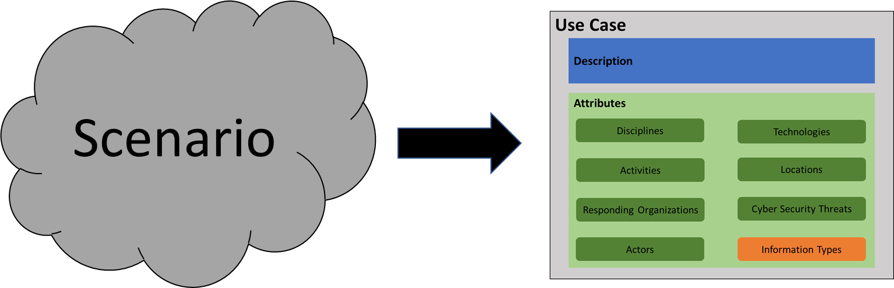

Putting the Use Case Model in Action
=============================================================================

In isolation, the model we have defined does not achieve our goal of
providing public safety cyber security guidance. To continue advancing
toward this goal, there are three more tasks we must complete.

1.  Identifying and obtaining sources for meaningful public safety
    scenarios

2.  Framing scenarios into our model

3.  Curating a collection of use cases to support security guidance

Identifying Meaningful Public Safety Scenarios
----------------------------------------------

Through our research we identified many potential sources for scenarios
to populate our use cases. However, all aspects of a scenario can change
depending on the perspective of each individual public safety
organization. This includes both their own operational requirements as
well as their cyber security requirements (and these will vary widely
given the parameters of the situation).

That said, we had a few strategies for mining scenarios. They include:

-   Existing apps

-   Training material

-   Case Reports

-   Standard procedures

-   Formal ontologies

Framing Scenarios
-----------------

Identifying meaningful and accurate public safety scenarios is a
complicated task. Using the model we defined in Section 3 above, we
needed a way to transpose scenarios we found into our formalized
structure. We called this process *framing*. To frame a scenario we used
the model as a lattice; using each of the attributes as a basis to
interrogate the scenario's description. The process of framing will
differ depending on which audience perspective we are approaching the
activity from. Below, we illustrate a hypothetical framing exercise from
each of our core stakeholders.

### Framing Example

This concept is best explained through an example. Let's take a look a
another example use case borrowed from the [NIST usability
document](https://inet.nist.gov/admr/coronavirus-covid-19-guidance-faqs/telework-resources-faqs)
we mentioned above:



Using the scenario as a source, and relying on our model, we can begin
to step through each of the attributes to formalize this use case. The
information gathered here is by no means complete, but it captures the
concept of what to think about when framing a use case.



This scenario is presented primarily from the point of view of the
responding **fire department**. **EMS** also represented. Remember, the
*disciplines* attribute is intended to capture which perspectives are
being shown in the scenario. The absence of the law enforcement from
this scenario isn't to imply they are not present, just that there
aren't facets in this scenario that directly map to their perspective.



The *responding organizations* attribute may seem redundant, but it was
included to add more depth to the disciplines attribute. Here, we list a
generic **fire department** as the responding organization. In some
scenarios, the differentiating between municipal, volunteer, private, or
federal firefighting organizations might be relevant. Furthermore, there
is no organization named that is providing emergency medical services,
so we can't narrow down this any further than is captured by the
discipline.



Despite being a relatively short scenario, there are a lot of public
safety activities we can identify. The scenario starts with a **call to
9-1-1**. The receiving dispatcher coordinates with the appropriate
public safety resources (**dispatch**). We see the initiation of the
Incident Management System (through the assignment of the incident
commander).

At the scene, we see fire fighter engaging in **fire fighting
operations**, **evacuating the building**. EMS is tending **triaging**
and tending to those who are injured.

Finally, in a trend that is becoming more and more common, social media
is used to **spread information** to the general public.



As with any real-world scenario, labeling actors in consistent and
meaningful ways, can be a challenge. The actors identified above may not
be an exhaustive, or precise as could be, but it illustrates the kinds
of people present during a public safety scenario. Identifying these
actors will help us to identify and contextualize *information types*
later.



This scenario only really has two technologies. We can infer the cab
driver making the originating 9-1-1 call is using a **smartphone**. The
second is not named but is nearly ubiquitous to the Public Safety Access
Point (PSAP): the **Computer Aided Dispatch System (CAD System)**.



There weren't any cyber security threats identified as part of the
scenario, so we can leave this attribute set empty.



The information types identified here are the central part to our
cybersecurity guidance. Remember we are attempting to classify the
information types in terms of
[risk](https://csrc.nist.gov/glossary/term/risk).



Building floor plans are mostly a matter of public record, thus making
their confidentiality requirements quiet low. The integrity and
availability of this data is moderate, as erroneous, out of date, or
tempered information could endanger responders and interfere with their
mission.



The risk associated with the list of available public safety will vary
greatly given the context of the scenario. In this situation, we regard
the confidently risk as low, given that the exposing this information
beyond the immediate operation doesn't directly put anyone at risk. The
integrity and availability of the information is rated at medium given
as any disruption in this information stands to delay or disrupt public
safety activities.

The following information types are examples of the kinds of information
that is collected as part of providing medical care:









We rated the confidentially of these types of information to be moderate
because of the
<a href="https://www.hhs.gov/hipaa/index.html" class="external">HIPAA</a>
related concerns that may need to be taken into consideration while
handling this type of data. Interference with the integrity or
availability of this kind of data has the potential to harm patients or
delay their care.

Curating Use Cases to Public Safety
-----------------------------------

Framing is a central part of the process for building a database of use
cases. It would seem straight forward to simply find sources for a
scenario, frame them, and publish the guidance contained in the newly
minted use cases. However, as it is the most subjective, it is also the
activity that can introduce the most bias and/or error in judgment on
behalf of the framer. The cyber security concerns differ by discipline
(fire, EMS, Law Enforcement) but also differ jurisdictionally at the
local, state, and federal levels. Depending on the amount of information
provided, the use cases may require a lot of gap-filling that NIST PSCR
doesn't itself have the resources to fill. The next section describes
how we pivoted to try and address this concern.

Atlas -- Putting Use Cases in Motion
------------------------------------

Maintaining a centralized, up-to-date, and nuanced collection of public
safety use cases is beyond the resources we had at our disposal. To
solve this problem, we prototyped a sharable tool to allow organizations
to frame their own use cases. We named this tool Atlas. Acting as both
an interactive worksheet and a search engine for use cases, Atlas seeks
to aide users with framing, searching, and cross-referencing public
safety use cases.

A full description of Atlas can be found on its [GitHub
page](https://gitlab.nist.gov/gitlab/public-safety-atlas/atlas).
However, the primary features of Atlas can be highlighted by approaching
each of these features from each of the audiences we described above.
